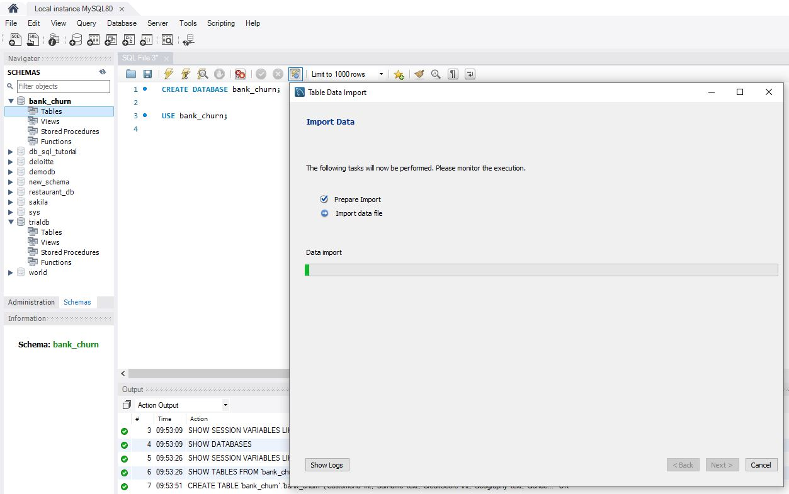
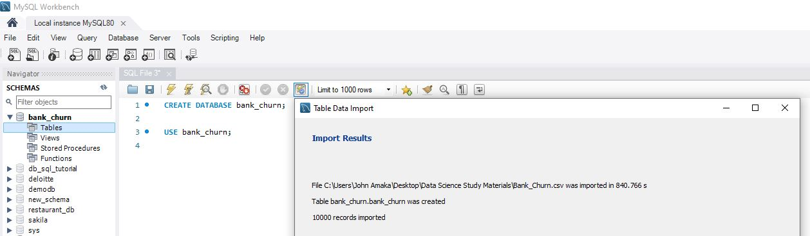
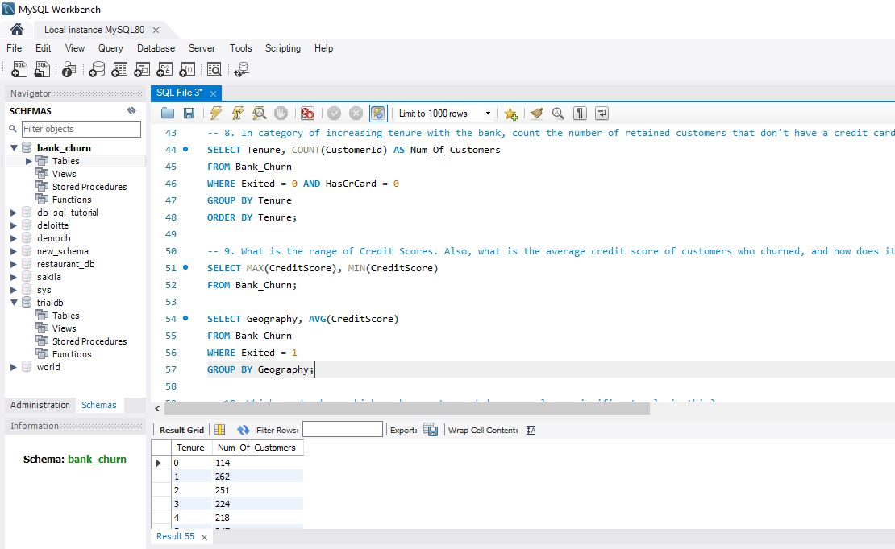
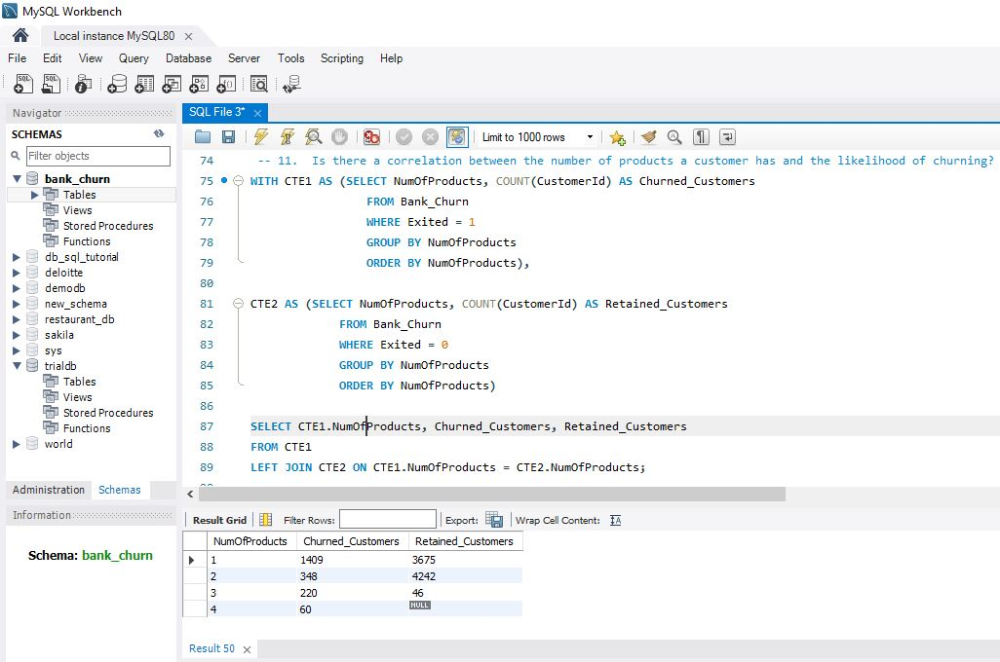
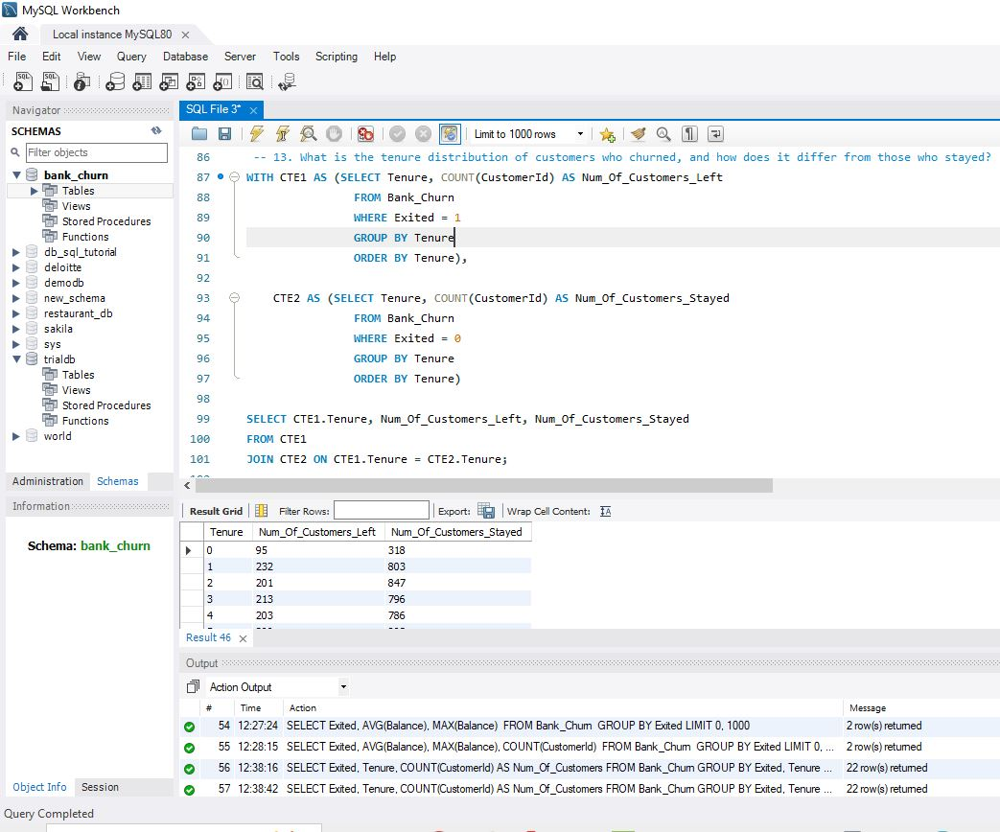

# Project Title: Bank_Customer_Churn

### Description

This project was undertaken to demonstrate my analytical skills using SQL to explore the churn records of customers in an European bank. The dataset was pulled from the Maven Analytics website. The project involved creating a database (bank_churn) and importing a csv file into a table within the database using MYSQL Workbench, performing exploratory data analysis (EDA), and then answering insightful business questions through SQL queries. 

### Objectives
1.	Explore The Records in the Table
2.	Analyze Customer Behavior

### Environments and Tools Used
- Windows 10
- MySQL Workbench

## Data Science Analysis Walk-Through

### Database and Tables Creation
##### Database: bank_churn

A table named Bank_Churn is created to store the Bank customers churn data. The table structure includes 13 columns for CustomerId, Surname, CreditScore, Geography, Gender, Age, Tenure, Balance, NumOfProducts, HasCrCard, IsActiveMember,  EstimatedSalary and Exited.

#### Table Creation Completed

In total, 13 questions were raised and a few of the most insightful have been highlighted below. 

#### Objective 1: Exploring the Data
The following SQL queries were developed to explore the data and have a general understanding:
1. Inspect the data, count the records grouped by Gender
2. View and count the countries represented in the data
3. Determine the number of customers that have churned/left and those still customers
4. Determine the number of retained customers with a credit card and those without
5. Determine the average tenure of retained customers that don't have a credit card

#### Objective 2: Analyzing Customer Behavior
The following SQL queries were developed to undertand and give insight into the bank customers' behavior:

1. In category of increasing tenure with the bank, count the number of retained customers that don't have a credit card
2. What is the range of Credit Scores. Also, what is the average credit score of customers who churned, and how does it compare across different geographies?
3. Which gender has a higher churn rate, and does age play a significant role in this?
4. Is there a correlation between the number of products a customer has and the likelihood of churning?
5. How does the balance of churned customers compare to those who did not churn?
6. What is the tenure distribution of customers who churned, and how does it differ from those who stayed?

### Screenshots
##### In category of increasing tenure with the bank, count the number of retained customers that don't have a credit card

#### Is there a correlation between the number of products a customer has and the likelihood of churning?

#### What is the tenure distribution of customers who churned, and how does it differ from those who stayed?

